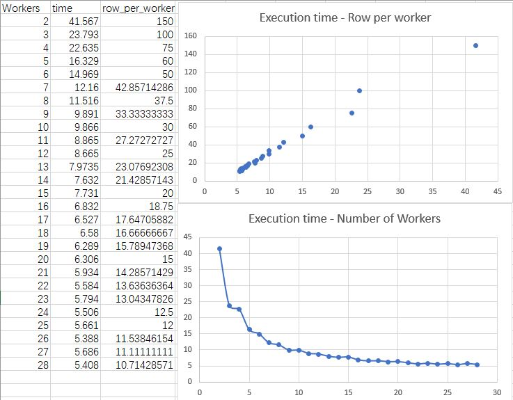
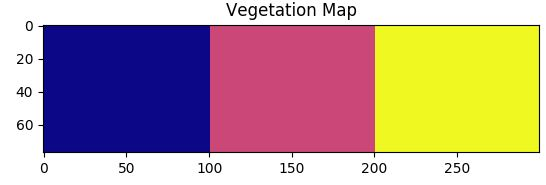
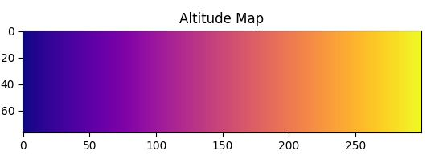
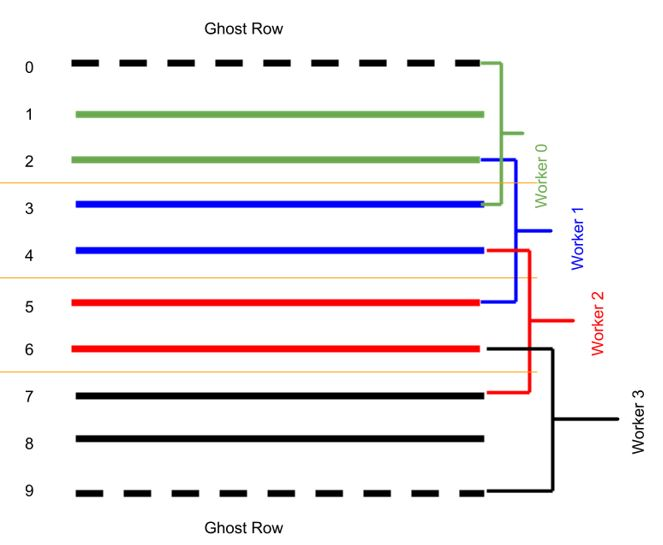
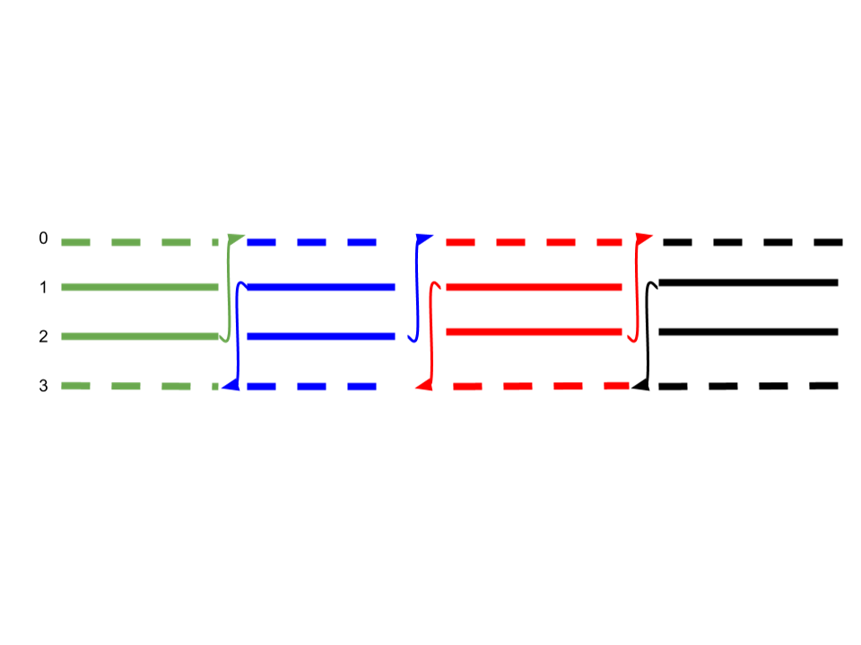

# Wildfire simulation using paralleled cellular automaton
Simulation of wildfire using cellular automaton and used mpi4py to parallel the program.   
Final Project for High Performance Computing and Parallel Computing  
May.2018  

## Environment Specification
In order to achieve best compatibility, this program only needs very basic prerequisite.
1. Openmpi/3.0.0
2. Python/2.7.11 (and mpi4py package)

However, to generate a better visualization, this program needs additional packages.
1. numpy
2. matplotlib  
If the program failed to import these two packages, then it will automatically run in pure text mode.

## Usage

### Run the code:
Clone the code from github using:`git clone https://github.com/XC-Li/Parallel_CellularAutomaton_Wildfire.git`   
After loading the module(openmpi and python), you can use `mpirun -n [n] python Parallel_Wild_Fire.py` to run this code.
You can specify the number of workers in `n` if you have multiple CPU.

### Easiest place to change
This program is carefully designed, so the places you can change is very few.
The easiest part to change is surrounded by `-----Quick Change-----`.
You can simply change:

|Variable Name|Acceptable Value|Purpose|
|-----|-----|-----|
|n_row_total|any positive integer| the total row of the grid|
|n_col|any positive integer| the total column of the grid|
|generation| any positive integer| the total number of iterations|
|p_continue_burn|between 0 and 1|the possibility one cell continues to burn in next time step|
|wind|True or False|Switch for wind factor in the model (True for on, False for off)|
|vegetation|True or False|Switch for vegetation factor in the model (True for on, False for off)|
|density|True or False|Switch for vegetation density factor in the model(True for on, False for off)|
|altitude|True or False|Switch for altitude factor in the model(True for on, False for off)|

Or you can do some custom changes on the environment initial functions:

|Function Name|Purpose|Output|
|----|----|----|
|thetas (a list)|the angle of wind and direction of fire spread| 3x3 list|
|init_vegation|the matrix for vegetation type|n_colxn_row list|
|init_density|the matrix for vegetation density|n_colxn_row list|
|init_altitude|the matrix for altitude|n_colxn_row list|
|init_forest|the matrix for initial forest condition|n_colxn_row list|

**Please don't change anything below the line `Do not change anything below this line`**

## Parallel Programming is the key to save time
  
  
Based on the experiment on GW's high-performance computing cluster colonial one, I found the execution time of this program is inversely proportional with the number of parallel workers.   
And the execution time has a linear relation with the number of rows that each worker has to compute.  
Which shows parallel computing can greatly reduce execution time when the problem is parallelable.  

## Interesting Findings
No special environment: boundary of fire is round(Visualize in matplotlab and pure text)

Different `p_continue_burn`: 0.1(Left) or 0.9(Right) affect the shape of boundary  
 

`Density` is on: Fire is more likely to spread to high density area(Right 1/3)  

`vegetation` is on : Fire is more likely to spread to Hallepo-pine area (Right 1/3)  

`altitude` is on : Fire is more likely to spread to higher place(Right side)  

`wind` is on: Fire is affected by the north wind(From North to South)  

All of the environment factor is on: `altitude` and `wind` are the most powerful factor

## Technical Detail
### Cellular Automaton Model
The model I use here is based on the research paper: ["A cellular automata model for forest fire spread prediction: The case
of the wildfire that swept through Spetses Island in 1990"  ](https://github.com/XC-Li/Parallel_CellularAutomaton_Wildfire/blob/master/A%20cellular%20automata%20model%20for%20forest%20fire%20spread%20prediction%20The%20case%20of%20the%20wildfire%20that%20swept%20through%20Spetses%20Island%20in%201990.pdf)

Each cell has 4 states:  
State = 1: The cell contains no forest fuel. This state may describe the cells corresponding to parts of the city with no vegetation,
rural areas with no vegetation etc. We assume that cells that are in this state cannot be burned.  
State = 2: The cell contains forest fuel that has not ignited.  
State = 3: The cell contains forest fuel that is burning.  
State = 4: The cell contained forest fuel that has been burned down.  

These 4 states changes under these 4 rules:  
Rule 1: IF state (i,j,t) = 1 THEN state (i,j,t + 1) = 1.  
This rule implies that the state of a cell with no forest fuel (empty cell) remains the same and thus it cannot catch fire.  
Rule 2: IF state (i,j,t) = 3 THEN state (i,j,t + 1) = 4.   
This rule implies that a burning cell at the current time step will be burned down at the next time step.  
Rule 3: IF state (i,j,t) = 4 THEN state (i,j,t + 1) = 4.  
This rule implies that the state of an empty cell that has been burned down in the previous step stays the same.  
Rule 4: IF state (i,j,t) = 3 THEN state (i ± 1, j ± 1, t + 1) = 3 with a probability pburn.  
**I changed Rule to IF state (i,j,t) = 3 THEN state (i,j,t + 1) = 4 with probability `1-p_continue_burn`**  

And I used the following formulas to determine pburn:
pburn=ph(1+pveg)(1+pden)pwps    

**Effect of the wind speed and direction**  
pw = exp(c1V)ft,   
ft = exp(Vc2(cos(&theta;)-1))  
&theta; is the angle between the direction of the fire propagation and the direction
of the wind.    

**Effect of the ground elevation**    
Ps = exp(a&theta;s)  
&theta;s = tan-1[(E1-E2)/l]

**Table for pden**  

|Category|Density|pden|
|----|----|----|
|1|Sparse|-0.4|
|2|Normal|0|
|3|Dense|0.3|

**Table for pveg**  

|Category|Type|pveg|
|----|----|----|
|1|Argicultural|-0.3|
|2|Thickets|0|
|3|Hallepo-pine|0.4|

**Table for other parameters**

|Parameter|Value|
|----|----|
|ph|0.58|
|a|0.078|
|c1|0.045|
|c2|0.131|

### Implementation
I implemented the model in the research paper to the code, and this is the structure of the program. 

### Parallel Design
The idea of parallel with MPI(Message Passing Interface) is also simple:
1. Assign a part of the full grid to each worker.

2. Let the worker exchange the top and bottom row after each iteration.

